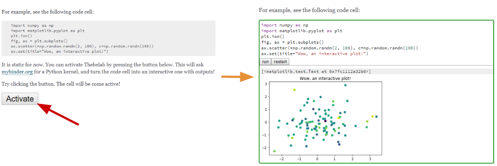

# ThebeLab: turning static HTML pages into live documents

[](https://greenkeeper.io/)

Have a static HTML page with code snippets? Your readers can edit and execute them right there. All it takes is:
- A brief header in the HTML page
- The ThebeLab javascript library (which can be fetched from the web)
- A computing backend (typically [binder](https://mybinder.org))



ThebeLab is a based on the [Jupyter](jupyter.org) technology, and thus supports [a wealth of programming languages](https://github.com/jupyter/jupyter/wiki/Jupyter-kernels). The original implementation, called [Thebe](https://github.com/oreillymedia/thebe) was a fork of the Jupyter code base. ThebeLab is a reimplementation of Thebe as a thin layer on top of [JupyterLab](https://github.com/jupyterlab/jupyterlab), making it more sustainable.

See [the ThebeLab Documentation](https://thebelab.readthedocs.io/en/latest/) for more information.

See the [examples directory](examples/), and browse the
[live output](https://minrk.github.io/thebelab/) for inspiration.
See also this
[blog post](https://blog.ouseful.info/2017/12/18/run-python-code-embedded-in-html-via-a-jupyter-kernel/).

## How ThebeLab works

Starting ThebeLab involves the following steps:
- Loading the thebelab javascript, typically [from a CDN](https://unpkg.com/thebelab);
- Fetching the ThebeLab configuration from the page header;
- Bootstrapping ThebeLab:
  - Re rendering the code cells to make them live cells.
    Optionally, the rendering can handle cells that contain
    a mixture of inputs and ouputs distinguished by prompts
    (see the stripPrompts option);
  - (optional) Requesting a notebook server from Binder;
  - (optional) Requesting a Jupyter kernel from the Jupyter server.

Bootstrap Thebelab by calling `thebelab.bootstrap()`. If `bootstrap: true` is
in the Thebelab configuration (see below), this will be triggered automatically
upon page load.

## Configuring ThebeLab

For complete information about configuring ThebeLab, see
[the ThebeLab documentation](https://thebelab.readthedocs.io/en/latest/).

You can configure thebelab with a script tag.
The script should have `type=text/x-thebe-config`
with a javascript object containing configuration options.

```html
<script type="text/x-thebe-config">
{
  binderOptions: {
    repo: "minrk/ligo-binder",
    ref: "master",
  }
}
</script>
```

A full config script with defaults:

```javascript
{
  // Whether thebelab should automatically trigger the bootstrap upon page load
  // if set to false, the page should contain some additional javascript
  // responsible for triggering the javascript when desired (e.g. connected to a button click).
  bootstrap: false,

  // arbitrary pre-render function called as part of bootstrap
  preRenderHook: false,

  // Whether to request the kernel immediately when thebelab is bootstrapped
  // instead of on executing code for the first time
  requestKernel: false,

  // Whether thebelab should look for predefined output of cells before execution
  // If this option is enabled and the next div after the cell has the attribute
  // data-output=true (default), then the content of this div is rendered as output
  predefinedOutput: false,

  // The selector for identifying whether an element should be treated as output
  outputSelector: '[data-output]'

  // Options for requesting a notebook server from mybinder.org
  binderOptions: {
    repo: "minrk/ligo-binder",
    ref: "master",
    binderUrl: "https://mybinder.org",
    // select repository source (optional). Supports Github(default), Gitlab, and Git
    repoProvider: "github",
  },

  // Options for requesting a kernel from the notebook server
  kernelOptions: {
    name: "python3",
    kernelName: "python3",
    // notebook server configuration; not needed with binder
    // serverSettings: {
    //      "baseUrl": "http://127.0.0.1:8888",
    //      "token": "test-secret"
    //    }
  },

  // Selector for identifying which elements on the page should
  // be made interactive
  selector: "[data-executable]",

  // Optional prompt handling during the rendering phase
  // Either false or a dictionary as in the example below
  stripPrompts: false,
  // stripPrompts: {
  //      inPrompt: 'sage: ',
  //      continuationPrompt: '....: ',
  //      // only apply the prompt stripping to cells matching this selector (optional)
  //      selector: '.sage-input',
  //    },

  // URL from which to load mathjax
  // set to `false` to disable mathjax
  mathjaxUrl: "https://cdnjs.cloudflare.com/ajax/libs/mathjax/2.7.5/MathJax.js",

  // mathjax configuration string
  mathjaxConfig: "TeX-AMS_CHTML-full,Safe",

  // Additional options to pass to CodeMirror instances
  codeMirrorConfig: {},
}
```

## Contributing

### Getting Started in the Development Environment

In order to get Thebelab running locally, you'll need to have Node installed on your system: https://nodejs.org/en/download/
Once installed, this also includes `npm` (Node Package Manager) which is what you will run in order to run Thebelab locally.

After cloning the repository, run:

`npm install`

This will install all dependencies in package.json.
In order to serve the Thebelab source code, run:

`npm run build:watch`

Now open `development.html` in your root directory to see Thebelab running. `development.html`
is a simple HTML page that demonstrates Thebelab functionality. You can edit it to test
out new features or configurations.

Running `npm run` will start Webpack which will bundle and serve the source code
along with `development.html`. As you change the code in Thebelab, the javascript
will automatically be re-built, but you'll be required to refresh the page.

### Staging Environment

To check changes made in a staging environment, there are several npm scripts to assist in generating a local staging environment.
To check changes that you've made locally in the documentation, run:

`npm run builddocs:staging`

open /docs/html and open the `index.html` file in your browser.

Alternatively, to compare these to the current changes in production, run:

`npm run builddocs:production`

to check your staging changes against the production build.

## Acknowledgements

`thebelab` was developed as a part of [OpenDreamKit](http://opendreamkit.org/) – Horizon 2020 European Research Infrastructure project (676541).
