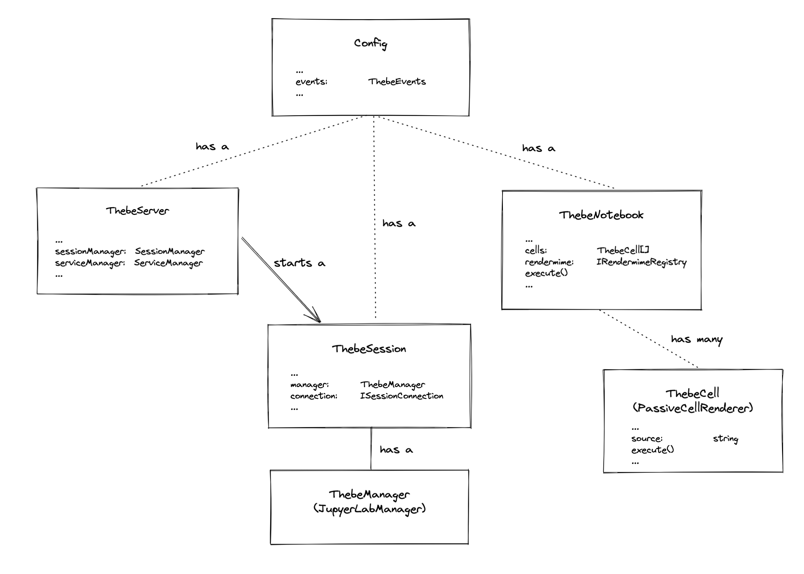

# Architecture

## Packages

- `thebe-core` provides a set of runtime object that re-use and wrap certain components and services provided by `juptyerlab`. The aim is to provide a simplified interface, abstracting away from Jupyter (lab) & lumino internals and types, that can be used in a web application to connect to juptyer services, interact with them and track state.
- `thebe-lite` provides the means to start a `JupyterLiteServer` and bundles all `Jupyterlite` dependencies in isolation
- `thebe` uses `thebe-core` with `codemirror` to turn code blocks on a how web page into interactive cells and allow them to be executed.

## Runtime Objects

The main objects provided are shown below in their default configuration.

In each object only some key members / properties are shown, the role of these and their scope is explained below:

- A `Config` object holds the set of current options alongside a `ThebeEvents` instance. A configuration culd be provided per application or per page.
  - `ThebeEvents` is an object that provided `jquery`-like events interface `trigger`, `on`, `one`, `off`, all objects that receive the `configc instance will use the same events object.
- A `ThebeServer` holds the `SessionManager` (`ServiceManager` in the case of JupyterLite)
  - it provides member function to establish a connecton
  - it provides functions to start a new or connect to an existing session/kernel
- A `ThebeSession` holds a kernel connection and is used to interact with the kernel
  - The session also creates an instance of a `WidgetManager` that is shared between all `RendermimeRegistryies` in notebooks or cells that attach to it
- A `ThebeNotebook` holds a list of cells and provides funcitons to load source code into cells and execute them
  - A notebook holds a `RendermimeRegistry` that is shared with aii it's cells
- A `ThebeCell` holds source code and can be executed in a session.
  - `ThebeCell` inherits from `PassiveThebeCell` which is only concerned with attaching to the DOM and rendering an `OutputArea`
  - If created independently of a `ThebeNotebook` it will hold it's own instance of a `RendermimeRegistry`
