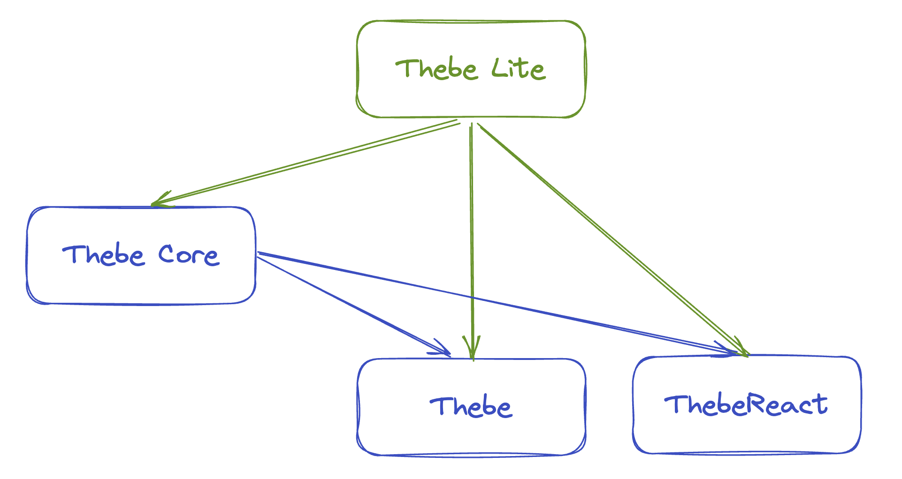

# `thebe`

![Thebe[core] Logo](public/thebe-logo.svg)

A typescript library for web based interactive computing with Jupyter backends.

```{tip}
Want to add `thebe` with `jupyterlite` to your static website? See [Lite Quick Start](quickstart-lite.md).
```

```{attention}
The version of `thebe` and it's sub-packages documented here are currently in a release candidate phase `(0.9.0-rc.x)`.

For documentation on the current release version of `thebe` (tagged as `latest` on npm) see the [Thebe Documentation on Read the Docs](https://thebe.readthedocs.io/en/latest/).
```

## The `thebe` packages

The `thebe` library is published as a collection of sub-packages on [npm](https://npmjs.com).



- The `thebe` package turns html tags with code into executable and editable cells that can be run interactively using a connection to a Jupyter kernel. It uses `thebe-core` internally.
- `thebe-core` provides a typescript class API for handling connections, notebooks, cells, events and more.
- `thebe-lite` is a drop in library that provides the Jupyterlite server for in-browser computation.
- `thebe-react` a library of React Providers and Hooks for getting started with `thebe` in React.

### What to use when

`thebe`
: Use when you have a static HTML website or a framework where you can add scripts to load the javascript bundle and set configuraton options easily. You're happy with loading codemirror to make all selected `<pre>` tags into editors and the default `thebe` UI. See [quickstart](/thebe/quickstart) or [using `thebe`](/thebe/using-thebe).

`thebe-core`
: Use when you are adding jupyter based computation into a typescript application, when you want Jupyter outputs on your webpage but you don't want to show all the code or when you want `thebe`-like behaviour, but want to complete control tover the UI and kernel connections. See [using `thebe-core`](/thebe/using-core).

`thebe-lite`
: Add this library alongside any other sub-package when you want to enable in-browser computation with the `useJupyterLite` option. See [using `thebe-lite`](/thebe/using-thebe-lite).

`thebe-react`
: Use if you are developing with the React or Remix frameworks. Other frameworks that leverage React may also work with the components provided in this library but are not tested. See [using `thebe-react`](/thebe/using-thebe-react).
