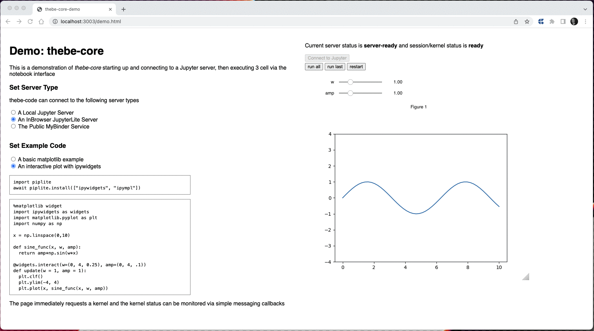

# thebe-core

`thebe-core` is a headless connector library allowing a developer to connect to and execute code on a Jupyter based compute resource from any Javascript environemnt.

Written in Typescript and indended for use in other packages and applications, `thebe-core` has minimal state and introduces no restrictions on UI frameworks that might be used. [thebe](https://github.com/jupyter-book/thebe) will use `thebe-core` to provide a `jquery` based connector, that uses prosemirror to enable editing and execution of code cells on any webpage.

`thebe-core` supports connecting to a BinderHub, JupyterHub, any Jupyter instance or JupyterLite with the pyiolite kernel.



## Status

`thebe-core` should be considered as beta software and may be subject to further significant changes, however it is ready for test integration and usage. We welcome feedback.

# Getting Started

Install the library from npm:

```
  npm install thebe-core
```

Thebe is loaded asynchronously so you need to copy the build artifacts into your project static directory (e.g. `public` in `react`) you can do that using:
`npx copy-thebe-assets <output_dir> [all,core,lite,thebe]`

e.g:

```
copy-thebe-assets public/thebe
```

## Typescript

Follow the Getting started from Typescript section of the docs

## Javascript

To use `thebe-core` directly from a web page or Javascript application, load the minified library via a script tag:

```
 <script src="thebe-core.min.js" type="text/javascript"></script>
```

# Contributing

To learn how to build `thebe-core` itself and contribute to the development of the library see [Contributing](contributing.md)

## Usage

For more information on how to invoke thebe and connect to a kernel see [demo/index.html](./demo/index.html) and [demo/demo.js](./demo/demo.js).

# Code of Conduct

See [this statement](https://github.com/executablebooks/meta/tree/master/docs/code-of-conduct.md) from Executable Books.

# License

`thebe-core` is licensed under BSD 3 Clause Revised License - see [LICENSE](./LICENSE).

# Acknowledgements

`thebe-core` is an out of core refactor of the `thebe` library, containing refactored code from the original.

It is currently stewarded by [the Executable Books Team](https://executablebooks.org/en/latest/team.html).

**Previous funding**

`thebe` was initially developed as a part of [OpenDreamKit](https://opendreamkit.org/) – Horizon 2020 European Research Infrastructure project (676541).

Additional support was provided by the U.S. Department of Education Open Textbooks Pilot Program funding for the LibreTexts project (P116T180029).
